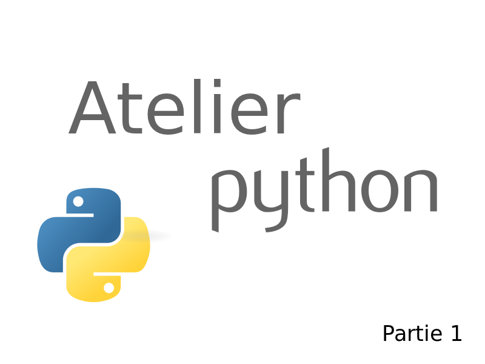

# Atelier Présentation Python

.fx: home

---

# C'est quoi python ?

.fx: fullimage

---

# Qui suis-je ?

.fx: bigbullet

* FELD Boris
* Étudiant en Génie Informatique 02
* Développeur PYTHON (depuis 2 ans)
* [http://feldboris.alwaysdata.net/](http://feldboris.alwaysdata.net/)
* [https://twitter.com/lothiraldan](https://twitter.com/lothiraldan)

---

# Python Késako ?

.fx: centerquote

> Python is a programming language that lets you work more quickly and integrate your systems more effectively. You can learn to use Python and see almost immediate gains in productivity and lower maintenance costs.

— <a href="http://python.org/">Site officiel Python</a>

---

# En français ?

.fx: centerquote

> Python est un langage qui va te permettre de programmer plus **rapidement** et plus **efficacement**.

— <a href="https://twitter.com/lothiraldan">@lothiraldan</a>

---

# Informations globales

.fx: bigbullet

* Python a été crée par **Guido Van Rossum** (considéré depuis comme **dictateur bienveillant à vie**).
* Le projet Python a été nommé ainsi car **Guido Van Rossum** est un fan des **Monthy Python** (comme tous les développeurs python d'ailleurs ^^).
* La première version a été écrite en 1989, durant 1 semaine de vacances de **Guido Van Rossum** durant le période des fêtes.

---

# Informations bis

.fx: bigbullet

* Considéré aujourd'hui comme **6ème langage le plus populaire** (par [Tiobe Index](http://www.tiobe.com/index.php/content/paperinfo/tpci/index.html)) et a gagné le prix du **Langage de l'année 2010** et celui de 2007 aussi.

---

# Historique des versions

* Python 3.2 (20 février 2011) : Version la plus à jour de la branche Python 3.x
* Python 3.1.3 (27 novembre 2010) : Version par défaut de la branche Python 3.x
* Python 3.0.1 (13 février 2009) : Mises à jour de sécurité uniquement.
* Python 2.7.1 (27 novembre 2010) : Version par défaut de la branche Python 2.x
* Python 2.6.6 (24 août 2010) : Mises à jour de sécurité uniquement.
* Python 2.5.5 (31 janvier 2010) : Mises à jour de sécurité uniquement.
* Python 2.4.6 (19 décembre 2008) : Obsolète, plus maintenu.
* Python 2.3.7 (11 mars 2008) : Obsolète, plus maintenu.
* Python 2.2.3 (30 mai 2003) : Obsolète, plus maintenu.
* Python 2.1.3 (8 avril 2002) : Obsolète, plus maintenu.
* Python 2.0.1 (Juin 2001) : Obsolète, plus maintenu.
* Python 1.6.1 (Septembre 2000) : Obsolète, plus maintenu.
* Python 1.5.2 (Avril 1999) : Obsolète, plus maintenu.

---

# Python 3000

> Une nouvelle version de Python, appelée Python 3.0 (le projet était appelé « Python 3000 » ou « Py3K ») abolit la compatibilité descendante avec la série des versions 2.x, dans le but d'éliminer les faiblesses actuelles du langage. La ligne de conduite du projet était de « réduire la redondance dans le fonctionnement de python par la suppression des méthodes obsolètes ». Python 3.0a1, la première version alpha, a été publiée le 31 août 2007, et il existe un PEP qui détaille les changements prévus.

— <a href="http://fr.wikipedia.org/wiki/Python_(langage)#Python_3000">Wikipédia</a>

Depuis, il existe deux branches de développement : Python 2.x et Python 3.x. Pour chaque branche, il y a une version de production, mais il est recommandé de passer à Python 3.x dès que possible (c'est à dire quand le plupart des librairies seront passées à Python 3.x).

---

# Guido Van Rossum

.fx: fullimage

